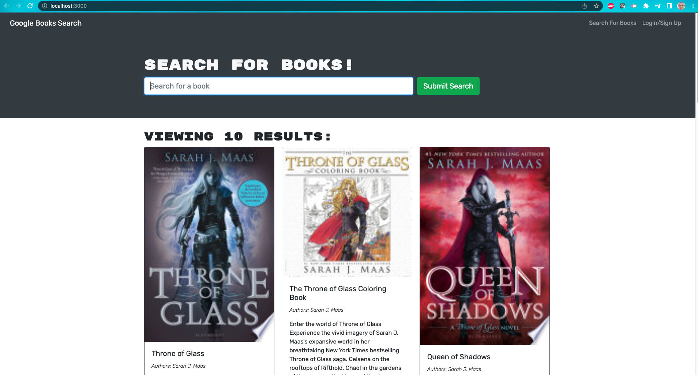

#Book Search Engine

##Table Of Contents
  *[Installation](#installation)
  *[Usage](#usage) 
  undefined
  *[Contributions](#contributions)
  *[Technologies Used](#technologies-used)
  *[Link](#link)
  *[Screenshots](#screenshots)
  *[Questions](#questions)

## Installation
Clone this repository then on the CLI run: 
    *npm i

## Usage
After installing the npm packages, enter:
    *npm run develop

Alternatively you could also just use the deployed heroku link below.

This application is covered by the following license: MIT.

## Contributions
All people can contribute! 

## Technologies Used
Express.js, Node.js, React.js, JavaScript, Apollo Server, GraphQL API

## Link
This is the deployed link: https://arcane-cove-36980.herokuapp.com/

## Screenshots

## Questions
If you have any questions, please contact me using the links below:
Github: https://github.com/hghe95
Email: hghe95@gmail.com